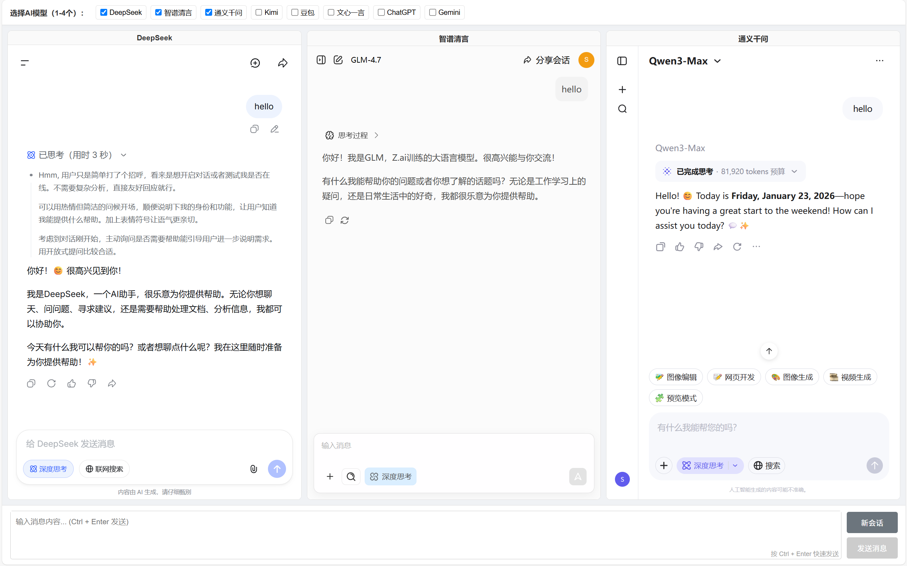

# AI Chat Compare

## 项目简介

AI Chat Compare 是一个强大的 AI 对话聚合对比工具，允许用户同时向多个 AI 模型发送相同的消息，并实时比较它们的回复。通过这个工具，用户可以更直观地评估不同 AI 模型的表现，选择最适合自己需求的 AI 助手。

## 功能特性

- **多模型并行对比**：同时选择 1-4 个 AI 模型进行实时对话对比
- **一键消息分发**：一次输入，同时发送给所有选定的 AI 模型
- **统一控制界面**：在一个页面中管理多个 AI 对话
- **快速新会话**：一键为所有选定模型开启新对话
- **响应式设计**：支持桌面端和移动端使用
- **本地存储**：自动保存用户的模型选择偏好
- **快捷键支持**：按 `Ctrl + Enter` 快速发送消息

## 功能预览

### 主界面预览



## 支持的 AI 模型

- DeepSeek
- 智谱清言
- 通义千问
- Kimi
- 豆包
- 文心一言
- ChatGPT
- Gemini

## 安装与设置

### 方法一：直接使用（推荐）

1. 克隆或下载本项目到本地
2. 安装浏览器扩展：
   - [Tampermonkey](https://www.tampermonkey.net/)（用于注入消息监听器）
   - [Header Editor](https://github.com/FirefoxBar/HeaderEditor)（用于修改HTTP头，解决跨域和iframe嵌入问题）

3. 配置 Tampermonkey 脚本：
   - 打开 Tampermonkey 扩展
   - 点击「创建新脚本」
   - 复制 `message-listener.js` 文件的内容到编辑器中
   - 保存脚本

4. 配置 Header Editor 规则：
   - 打开 Header Editor 扩展
   - 点击「添加规则」
   - 填写以下信息：
     - 名称：AI Chat Compare 头修改
     - 规则类型：修改响应头
     - 匹配类型：所有URL
     - 正则表达式：`.*`
     - 操作：运行脚本
     - 脚本：复制 `modify-header.js` 文件的内容
   - 保存规则

### 方法二：本地服务器运行

如果直接打开 HTML 文件遇到跨域问题，可以使用本地服务器运行：

```bash
# 使用 Python 3
python -m http.server 8000

# 或使用 Node.js (需要安装 http-server)
npm install -g http-server
http-server -p 8000
```

然后在浏览器中访问 `http://localhost:8000`

## 使用说明

1. **选择 AI 模型**：在顶部的模型选择区域，勾选你想要对比的 AI 模型（1-4个）
2. **等待页面加载**：系统会自动在下方的 iframe 中加载选中的 AI 聊天页面
3. **登录 AI 账号**：在每个 iframe 中登录对应的 AI 服务账号（首次使用时需要）
4. **输入消息**：在底部的输入框中输入你想要发送的消息
5. **发送消息**：点击「发送消息」按钮或按 `Ctrl + Enter` 快捷键，消息会同时发送给所有选中的 AI 模型
6. **比较回复**：在各个 iframe 中查看不同 AI 模型的回复，进行对比
7. **开启新会话**：点击「新会话」按钮，为所有选中的 AI 模型开启新的对话

## 技术原理

1. **前端架构**：使用 Vue.js 构建响应式用户界面
2. **消息分发**：通过 `postMessage` API 向各个 iframe 中的 AI 聊天页面发送消息
3. **页面控制**：通过 Tampermonkey 脚本注入到各个 AI 页面，实现自动填充消息和发送
4. **跨域处理**：通过 Header Editor 修改 HTTP 响应头，解决 iframe 嵌入限制

## 注意事项

1. **登录状态**：首次使用时，需要在每个 iframe 中单独登录对应的 AI 服务账号
2. **浏览器兼容性**：推荐使用 Chrome、Edge 等现代浏览器
3. **性能考虑**：同时开启多个 AI 模型可能会增加浏览器内存占用
4. **API 限制**：部分 AI 服务可能有使用频率限制，请合理使用
5. **隐私保护**：所有消息处理均在本地完成，不会上传到第三方服务器

## 项目结构

```
ai-chat-compare/
├── index.html          # 主页面文件
├── message-listener.js # Tampermonkey 脚本
├── modify-header.js    # Header Editor 脚本
├── README.md           # 项目说明文件
└── LICENSE             # 许可证文件
```

## 许可证

本项目采用 MIT 许可证，详见 LICENSE 文件。

## 贡献

欢迎提交 Issue 和 Pull Request 来改进这个项目！

## 联系方式

如有问题或建议，欢迎联系项目维护者。
